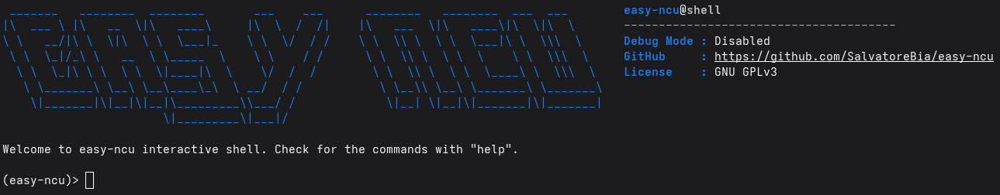

# easy-ncu

`easy-ncu` is an interactive shell which aims to simplify the extraction of kernel metrics collected through nsight-compute. In addition to that, it allows to aggregate values (i.e., sum and average) of specified metrics on different kernel launches and much more ( to be done, obviously :) ).

The currently available commands can be seen by typing `help`. To see the description of each command you can type `help <command_name>`.

The code allows for collecting the following sections (more will be added later):
- Speed of Light
- Compute Workload Analysis
- Warp State Statistics
- Occupancy
- Roofline (not tested properly)

---

### Rule Evaluation

Since a lot of metrics inside an NCU report are calculated by Nsight referencing specific formulas, an `eval` command was added to the shell. This command can evaluate any custom rule file against the currently selected kernel, extracting hardware counters on the fly and solving custom algebraic expressions safely.

#### Rule File Syntax

Rule files (typically saved with a `.rule` extension) use a simple, plain-text syntax divided into two mandatory blocks: [VARIABLES] and [EXPRESSION].

1. [VARIABLES] Block: This section maps easy-to-read aliases to the raw NVIDIA metric names found in the report.
   * Syntax: alias = nvidia_metric_name
   * Note: If a metric is not found in the specific report or returns None, easy-ncu will automatically fallback-initialize it to 0.0 to prevent runtime crashes.
   
2. [EXPRESSION] Block: This section contains the actual algebraic formulas you want to compute. 
   * Syntax: result_name = math_expression_using_aliases
   * Supported Operations: Standard operators (+, -, *, /, **) and native multi-argument mathematical functions (currently, only `max()` and `min()`).
   * Chaining: Expressions are evaluated top-to-bottom. You can use the result of a previous expression inside a subsequent one!

You can check the example rule file `resources/example.rule` for reference.